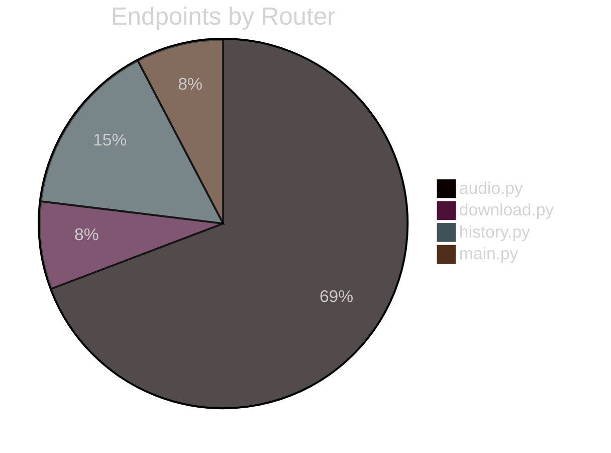

# API Reference

Complete endpoint documentation for FFmpeg Sandbox (28 endpoints).

## Endpoint Summary



| Method | Path | Router | Response |
|--------|------|--------|----------|
| GET | `/` | main.py | index.html |
| GET | `/health` | main.py | JSON |
| POST | `/process` | audio.py | preview.html |
| POST | `/extract` | audio.py | preview.html |
| GET | `/preview/{filename}` | audio.py | FileResponse |
| GET | `/duration/{filename}` | audio.py | JSON |
| GET | `/clip-preview` | audio.py | StreamingResponse |
| GET | `/clip-video-preview` | audio.py | StreamingResponse |
| POST | `/upload` | audio.py | upload_status.html |
| GET | `/process-with-progress` | audio.py | SSE Stream |
| GET | `/partials/filter-chain` | audio.py | filters_tabs.html |
| GET | `/partials/filters-tab/{tab}` | audio.py | filters_tabs.html |
| GET | `/partials/accordion/{category}` | audio.py | accordion.html |
| POST | `/partials/accordion-preset/{cat}/{preset}` | audio.py | accordion.html |
| GET | `/partials/presets-accordion/{category}` | audio.py | presets_accordion.html |
| POST | `/toggle-theme-preset/{type}/{key}` | audio.py | presets_accordion.html |
| GET | `/partials/save-shortcut-modal/{type}/{cat}` | audio.py | modal.html |
| POST | `/shortcuts/save` | audio.py | accordion.html |
| DELETE | `/shortcuts/{type}/{cat}/{key}` | audio.py | accordion.html |
| GET | `/shortcuts/export` | audio.py | YAML file |
| POST | `/shortcuts/import` | audio.py | import_result.html |
| POST | `/download/validate` | download.py | download_status.html |
| POST | `/download` | download.py | download_complete.html |
| GET | `/history` | history.py | history.html |
| DELETE | `/history/{entry_id}` | history.py | history.html |
| GET | `/history/{entry_id}/apply` | history.py | filters_tabs.html |
| GET | `/history/{entry_id}/preview` | history.py | history_preview.html |

---

## Main Routes

### GET `/`

Main application entry point.

| Attribute | Value |
|-----------|-------|
| **Router** | `main.py` |
| **Response** | `index.html` |
| **Auth** | None |

**Context Variables:**
- `input_files` - List of available media files
- `user_settings` - Current UserSettings object
- `*_presets` - All 13 category preset dictionaries
- `video_theme_presets`, `audio_theme_presets`

### GET `/health`

Docker health check endpoint.

| Attribute | Value |
|-----------|-------|
| **Router** | `main.py` |
| **Response** | `{"status": "healthy"}` |

---

## Audio Processing Routes

### POST `/process`

Process media with current filter settings.

| Parameter | Type | Required | Default |
|-----------|------|----------|---------|
| `input_file` | str | Yes | - |
| `start_time` | str | No | `00:00:00.000` |
| `end_time` | str | No | `00:00:06.000` |
| `output_format` | str | No | `mp4` |

**Response:** `partials/preview.html`

**HTMX Trigger:**
```html
<form hx-post="/process" hx-target="#preview-area" hx-swap="innerHTML">
```

### POST `/extract`

Extract clip without applying filters.

| Parameter | Type | Required | Default |
|-----------|------|----------|---------|
| `input_file` | str | Yes | - |
| `start_time` | str | No | `00:00:00` |
| `end_time` | str | No | `00:00:06` |

**Response:** `partials/preview.html`

### GET `/preview/{filename}`

Serve processed media file.

| Parameter | Type | Description |
|-----------|------|-------------|
| `filename` | path | Output filename |

**Response:** `FileResponse` with appropriate MIME type

### GET `/duration/{filename}`

Get media file metadata.

| Parameter | Type | Description |
|-----------|------|-------------|
| `filename` | query | Input filename |

**Response:**
```json
{
  "duration_ms": 10000,
  "duration_formatted": "00:00:10",
  "file_type": "video",
  "width": 1920,
  "height": 1080,
  "video_codec": "h264",
  "audio_codec": "aac",
  "sample_rate": 48000
}
```

### GET `/clip-preview`

Stream audio preview clip.

| Parameter | Type | Description |
|-----------|------|-------------|
| `filename` | query | Input filename |
| `start` | query | Start time (HH:MM:SS.mmm) |
| `end` | query | End time |

**Response:** `StreamingResponse` (audio/mpeg)

### GET `/clip-video-preview`

Stream video preview clip.

| Parameter | Type | Description |
|-----------|------|-------------|
| `filename` | query | Input filename |
| `start` | query | Start time |
| `end` | query | End time |

**Response:** `StreamingResponse` (video/mp4)

### POST `/upload`

Upload media file.

| Parameter | Type | Description |
|-----------|------|-------------|
| `file` | UploadFile | Media file |

**Response:** `partials/upload_status.html`

**HTMX Trigger:**
```html
<input hx-post="/upload" hx-target="#upload-status" hx-encoding="multipart/form-data">
```

### GET `/process-with-progress`

Process with SSE progress streaming.

| Parameter | Type | Default |
|-----------|------|---------|
| `input_file` | query | Required |
| `start_time` | query | `00:00:00` |
| `end_time` | query | `00:00:06` |
| `output_format` | query | `mp4` |

**Response:** `EventSourceResponse`

**SSE Events:**
| Event | Data |
|-------|------|
| `status` | `{"type": "status", "message": "..."}` |
| `progress` | `{"type": "progress", "percent": 50, "current_ms": 5000}` |
| `log` | `{"type": "log", "message": "..."}` |
| `complete` | `{"type": "complete", "output_file": "..."}` |
| `error` | `{"type": "error", "message": "..."}` |

---

## Filter Chain Routes

### GET `/partials/filter-chain`

Load complete filter UI.

| Parameter | Type | Description |
|-----------|------|-------------|
| `filename` | query | Current file (optional) |

**Response:** `partials/filters_tabs.html`

### GET `/partials/filters-tab/{tab}`

Switch filter tab.

| Parameter | Type | Values |
|-----------|------|--------|
| `tab` | path | `audio`, `video`, `presets` |
| `filename` | query | Current file |

**Response:** `partials/filters_tabs.html`

**HTMX Trigger:**
```html
<button hx-get="/partials/filters-tab/audio" hx-target="#filters-tabs-container" hx-swap="outerHTML">
```

### GET `/partials/accordion/{category}`

Expand/collapse accordion section.

| Parameter | Type | Values |
|-----------|------|--------|
| `category` | path | volume, tunnel, frequency, speed, pitch, noise_reduction, compressor, brightness, contrast, saturation, blur, sharpen, transform |
| `filename` | query | Current file |
| `current_category` | query | Currently expanded category |

**Response:** `partials/filters_audio_accordion.html` or `partials/filters_video_accordion.html`

### POST `/partials/accordion-preset/{category}/{preset}`

Apply shortcut preset.

| Parameter | Type | Description |
|-----------|------|-------------|
| `category` | path | Filter category |
| `preset` | path | Preset key |
| `filename` | form | Current file |

**Response:** Updated accordion partial

**Side Effects:** Updates user settings file

### GET `/partials/presets-accordion/{category}`

Expand theme presets accordion.

| Parameter | Type | Values |
|-----------|------|--------|
| `category` | path | `video_presets`, `audio_presets` |
| `filename` | query | Current file |

**Response:** `partials/filters_presets_accordion.html`

### POST `/toggle-theme-preset/{media_type}/{preset_key}`

Toggle theme preset in chain.

| Parameter | Type | Description |
|-----------|------|-------------|
| `media_type` | path | `audio` or `video` |
| `preset_key` | path | Preset key or `none` |
| `filename` | form | Current file |

**Response:** Updated presets accordion

**Behavior:**
- If preset in chain: removes it
- If not in chain: adds to end
- If `none`: clears entire chain

---

## Shortcut Management Routes

### GET `/partials/save-shortcut-modal/{filter_type}/{category}`

Show save shortcut modal.

| Parameter | Type | Values |
|-----------|------|--------|
| `filter_type` | path | `audio`, `video` |
| `category` | path | Filter category |
| `filename` | query | Current file |

**Response:** `partials/save_shortcut_modal.html`

### POST `/shortcuts/save`

Save custom shortcut.

| Parameter | Type | Description |
|-----------|------|-------------|
| `filter_type` | form | `audio` or `video` |
| `category` | form | Filter category |
| `name` | form | Display name |
| `description` | form | Description |
| `preset_category` | form | Category (default: Custom) |
| `...` | form | Category-specific values |

**Response:** Updated accordion with success message

### DELETE `/shortcuts/{filter_type}/{category}/{shortcut_key}`

Delete custom shortcut.

| Parameter | Type | Description |
|-----------|------|-------------|
| `filter_type` | path | `audio` or `video` |
| `category` | path | Filter category |
| `shortcut_key` | path | Shortcut key |
| `filename` | query | Current file |

**Response:** Updated accordion

### GET `/shortcuts/export`

Export shortcuts as YAML.

| Parameter | Type | Description |
|-----------|------|-------------|
| `filter_type` | query | Filter by type (optional) |
| `category` | query | Filter by category (optional) |
| `include_system` | query | Include built-in presets |

**Response:** YAML file download

### POST `/shortcuts/import`

Import shortcuts from YAML.

| Parameter | Type | Description |
|-----------|------|-------------|
| `file` | UploadFile | YAML file |
| `merge` | form | Merge with existing (default: true) |
| `filename` | form | Current file |

**Response:** `partials/import_result.html`

---

## Download Routes

### POST `/download/validate`

Validate download URL.

| Parameter | Type | Description |
|-----------|------|-------------|
| `download_url` | form | Video URL |

**Response:** `partials/download_status.html`

**Success Context:**
```json
{
  "status": "ready",
  "video_info": {
    "title": "...",
    "duration": "5:30",
    "uploader": "...",
    "size": "150 MB"
  }
}
```

### POST `/download`

Download video.

| Parameter | Type | Description |
|-----------|------|-------------|
| `url` | form | Validated URL |

**Response:** `partials/download_complete.html`

---

## History Routes

### GET `/history`

Load processing history.

**Response:** `partials/history.html`

**HTMX Trigger:**
```html
<div hx-get="/history" hx-trigger="load" hx-target="this">
```

### DELETE `/history/{entry_id}`

Delete history entry.

| Parameter | Type | Description |
|-----------|------|-------------|
| `entry_id` | path | History entry ID |
| `filename` | query | Current file |

**Response:** Updated `partials/history.html`

### GET `/history/{entry_id}/apply`

Apply history settings to filter chain.

| Parameter | Type | Description |
|-----------|------|-------------|
| `entry_id` | path | History entry ID |
| `filename` | query | Current file |

**Response:** `partials/filters_tabs.html`

**HX-Trigger Header:**
```json
{"historyApplied": {"startTime": "00:00:00", "endTime": "00:00:10"}}
```

### GET `/history/{entry_id}/preview`

Preview history output file.

| Parameter | Type | Description |
|-----------|------|-------------|
| `entry_id` | path | History entry ID |

**Response:** `partials/history_preview.html`
