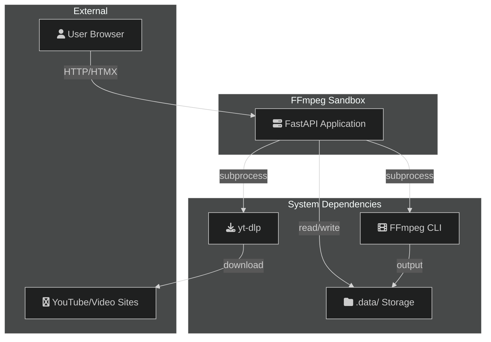
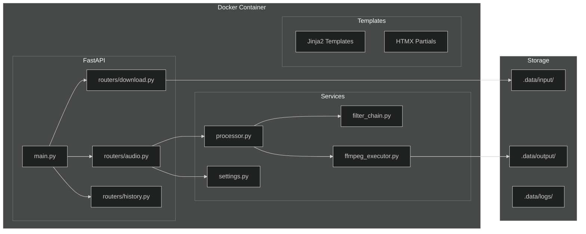
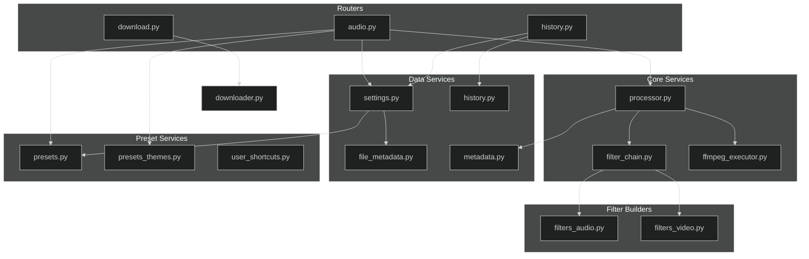
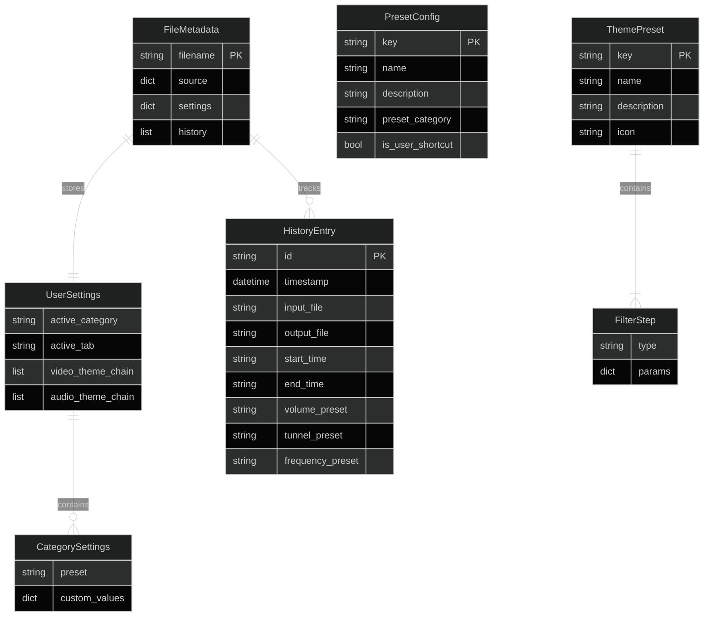
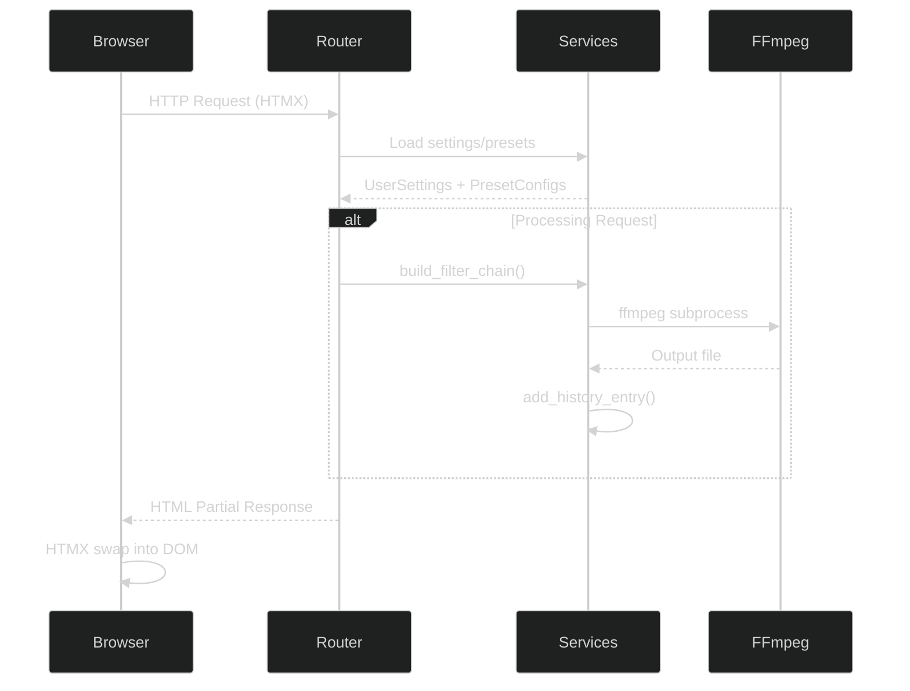

# Architecture

FFmpeg Sandbox system architecture and component relationships.

## C4 Context Diagram

High-level system boundary showing external dependencies.



## C4 Container Diagram

Application containers and their interactions.



## Component Diagram

Service layer module dependencies.



## Data Model (ER Diagram)

Core data structures and their relationships.



## Filter Categories

### Audio Filters (7)

| Category | Service Function | FFmpeg Filter |
|----------|-----------------|---------------|
| Volume | `build_volume_filter()` | `volume={val}` |
| Tunnel | `build_tunnel_filter()` | `aecho=0.8:0.85:{delays}:{decays}` |
| Frequency | `build_frequency_filter()` | `highpass=f={hz},lowpass=f={hz}` |
| Speed | `build_speed_filter()` | `atempo={ratio}` (chained for extremes) |
| Pitch | `build_pitch_filter()` | `asetrate,atempo,aresample` |
| Noise Reduction | `build_noise_reduction_filter()` | `afftdn=nf={floor}:nr={reduction}` |
| Compressor | `build_compressor_filter()` | `acompressor=threshold:ratio:...` |

### Video Filters (6 + 4 theme-only)

| Category | Service Function | FFmpeg Filter |
|----------|-----------------|---------------|
| Brightness | `build_eq_filter()` | `eq=brightness={val}` |
| Contrast | `build_eq_filter()` | `eq=contrast={val}` |
| Saturation | `build_eq_filter()` | `eq=saturation={val}` |
| Blur | `build_blur_filter()` | `gblur=sigma={val}` |
| Sharpen | `build_sharpen_filter()` | `unsharp=5:5:{amount}:5:5:0` |
| Transform | `build_transform_filter()` | `hflip\|vflip\|transpose` |
| Crop | `build_crop_filter()` | `crop=ih*{ratio}:ih` |
| Scale | `build_scale_filter()` | `scale={w}:{h}` |
| Colorshift | `build_colorshift_filter()` | `rgbashift=rh=-{n}:bh={n}` |
| Overlay | `build_overlay_filter()` | `drawtext=...` |

## File System Layout

```
.data/
├── input/
│   ├── video.mp4           # Uploaded/downloaded media
│   └── video.yml           # Per-file metadata + settings + history
├── output/
│   └── processed_*.mp4     # FFmpeg output files
├── logs/
│   └── app.log             # Application logs
├── .user_settings.yml      # Global user preferences
├── user-presets.yml        # Custom user shortcuts
└── history.json            # Processing history index
```

## Request Flow Overview


