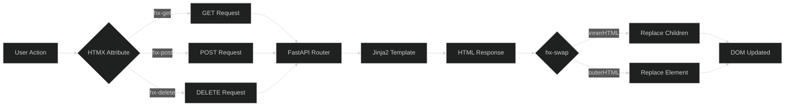
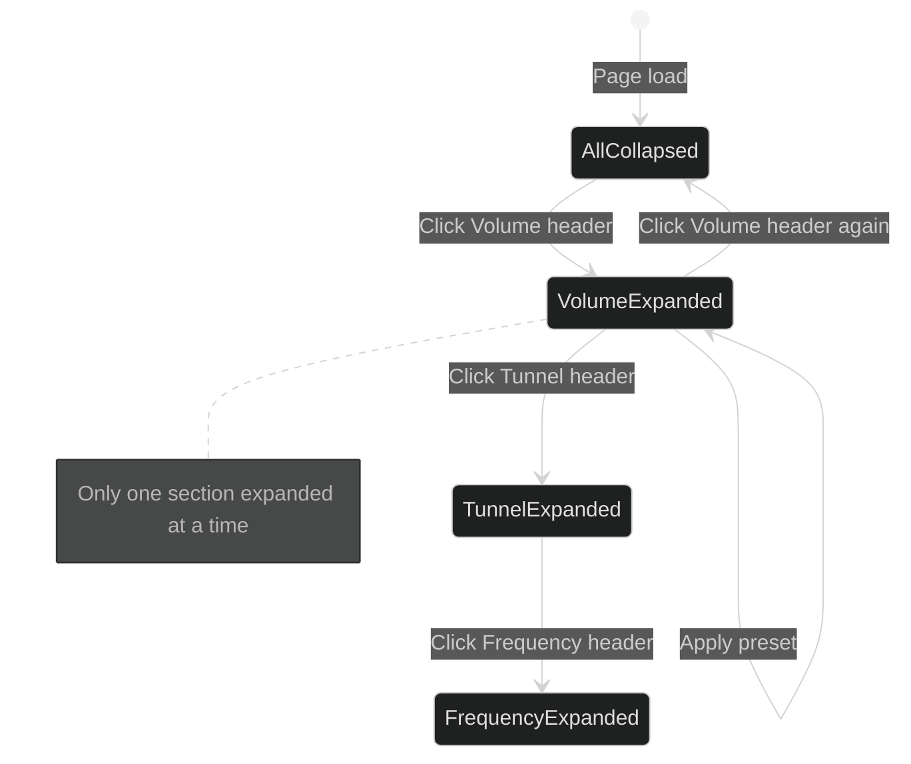
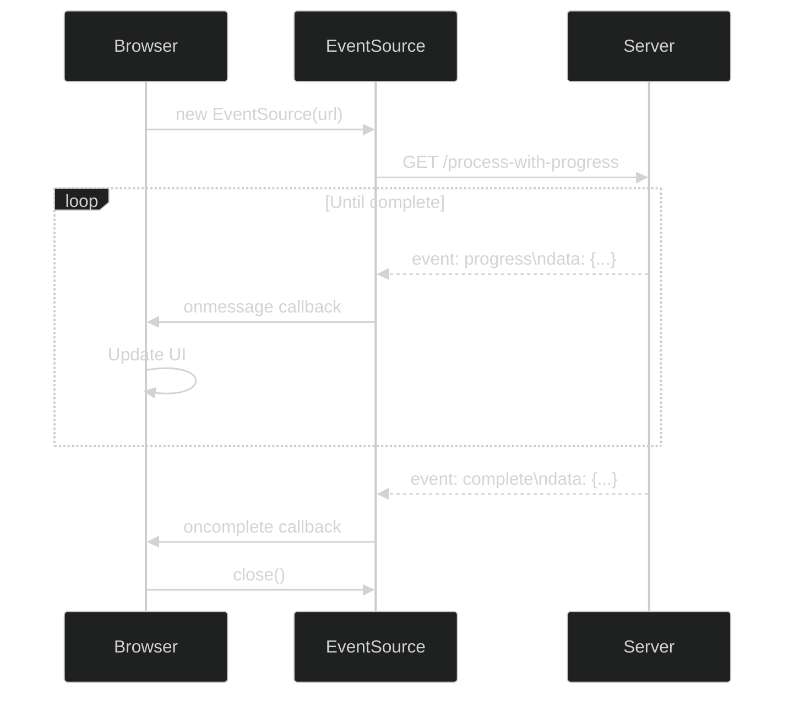

# HTMX Patterns

HTMX swap strategies, template mapping, and event patterns used in FFmpeg Sandbox.

## HTMX Request Flow



## Swap Strategies

| Strategy | Behavior | Use Case |
|----------|----------|----------|
| `innerHTML` | Replace target's children | Preview area, status messages |
| `outerHTML` | Replace entire target | Tab switching, accordion updates |

### innerHTML Example

```html
<!-- Target container keeps its attributes -->
<div id="preview-area" class="preview-container">
    <!-- Content replaced here -->
</div>

<button hx-get="/preview" hx-target="#preview-area" hx-swap="innerHTML">
    Preview
</button>
```

### outerHTML Example

```html
<!-- Entire element replaced including attributes -->
<div id="filters-tabs-container" class="tabs">
    <!-- Entire container replaced -->
</div>

<button hx-get="/partials/filters-tab/video"
        hx-target="#filters-tabs-container"
        hx-swap="outerHTML">
    Video
</button>
```

## Template to Endpoint Mapping

```mermaid
%%{init: {'theme': 'dark'}}%%
graph TD
    subgraph Templates
        I[index.html]
        FT[filters_tabs.html]
        FA[filters_audio_accordion.html]
        FV[filters_video_accordion.html]
        FP[filters_presets_accordion.html]
        H[history.html]
        P[preview.html]
    end

    subgraph Endpoints
        E1[/partials/filter-chain]
        E2[/partials/filters-tab/*]
        E3[/partials/accordion/*]
        E4[/partials/accordion-preset/*/*]
        E5[/partials/presets-accordion/*]
        E6[/toggle-theme-preset/*/*]
        E7[/history]
        E8[/history/*/apply]
        E9[/process]
    end

    I -->|includes| FT
    FT -->|hx-get| E2
    FT -->|contains| FA
    FT -->|contains| FV
    FT -->|contains| FP

    FA -->|hx-get| E3
    FA -->|hx-post| E4
    FV -->|hx-get| E3
    FV -->|hx-post| E4
    FP -->|hx-get| E5
    FP -->|hx-post| E6

    H -->|hx-get| E8
    I -->|hx-post| E9
    E9 -->|returns| P
    E8 -->|returns| FT
```

## Accordion State Machine



## Dynamic Values Pattern

### JavaScript Value Injection

```html
<!-- hx-vals with JavaScript expression -->
<button hx-post="/partials/accordion-preset/volume/loud"
        hx-vals="js:{filename: window.currentFilename || ''}">
    Loud
</button>
```

### Form Include Pattern

```html
<!-- Include specific input values -->
<button hx-post="/download"
        hx-include="#download_url">
    Download
</button>
```

### Hidden Input Pattern

```html
<!-- Pass current file context -->
<input type="hidden" name="filename" value="{{ filename }}">
```

## Custom Events (HX-Trigger)

### Server-Sent Events

```python
# In router
response.headers["HX-Trigger"] = json.dumps({
    "historyApplied": {
        "startTime": entry.start_time,
        "endTime": entry.end_time
    }
})
```

### Client Event Listener

```javascript
document.body.addEventListener('historyApplied', function(e) {
    const detail = e.detail;
    ClipRangeController.setRange(
        parseTimeToMs(detail.startTime),
        parseTimeToMs(detail.endTime)
    );
});
```

## SSE (Server-Sent Events) Pattern



### SSE Implementation

```javascript
// Client
const eventSource = new EventSource(`/process-with-progress?${params}`);

eventSource.addEventListener('progress', (e) => {
    const data = JSON.parse(e.data);
    updateProgressBar(data.percent);
});

eventSource.addEventListener('complete', (e) => {
    const data = JSON.parse(e.data);
    closeModal();
    refreshHistory();
    eventSource.close();
});
```

```python
# Server
async def process_with_progress(...):
    async def event_generator():
        async for progress in process_video_with_progress(...):
            yield {
                "event": progress["type"],
                "data": json.dumps(progress)
            }

    return EventSourceResponse(event_generator())
```

## Template Hierarchy

```
index.html
├── partials/filters_tabs.html (included statically)
│   ├── partials/filters_audio_accordion.html
│   │   └── [7 category sections]
│   ├── partials/filters_video_accordion.html
│   │   └── [6 category sections]
│   └── partials/filters_presets_accordion.html
│       ├── Video presets section
│       └── Audio presets section
├── partials/history.html (loaded via hx-trigger="load")
│   └── [History entry rows]
├── partials/preview.html (swapped on process)
│   └── Audio/video player
└── partials/upload_status.html (swapped on upload)
```

## Common HTMX Attributes

| Attribute | Purpose | Example |
|-----------|---------|---------|
| `hx-get` | GET request | `hx-get="/history"` |
| `hx-post` | POST request | `hx-post="/process"` |
| `hx-delete` | DELETE request | `hx-delete="/history/123"` |
| `hx-target` | Swap target | `hx-target="#preview-area"` |
| `hx-swap` | Swap strategy | `hx-swap="innerHTML"` |
| `hx-trigger` | Trigger event | `hx-trigger="load"` |
| `hx-include` | Include inputs | `hx-include="#form-id"` |
| `hx-vals` | Extra values | `hx-vals='{"key": "value"}'` |
| `hx-confirm` | Confirmation | `hx-confirm="Delete?"` |
| `hx-encoding` | Form encoding | `hx-encoding="multipart/form-data"` |

## Error Handling Pattern

```html
<!-- Server returns error partial -->
<div id="error-container" class="error-message">
    {{ error_message }}
</div>

<!-- Or use HX-Retarget header -->
```

```python
# Server-side error handling
if error:
    return templates.TemplateResponse(
        "partials/error.html",
        {"request": request, "error": str(error)},
        status_code=400
    )
```

## Loading Indicators

```html
<!-- Built-in HTMX indicator -->
<button hx-post="/process" hx-indicator="#spinner">
    <span class="btn-text">Process</span>
    <span id="spinner" class="htmx-indicator">
        <i class="fa fa-spinner fa-spin"></i>
    </span>
</button>
```

## Trigger Modifiers

| Modifier | Effect |
|----------|--------|
| `load` | Trigger on element load |
| `revealed` | Trigger when scrolled into view |
| `every 2s` | Poll every 2 seconds |
| `delay:500ms` | Debounce by 500ms |
| `throttle:1s` | Throttle to once per second |
| `from:body` | Listen on body element |

### Example: Auto-load History

```html
<div id="history-area"
     hx-get="/history"
     hx-trigger="load"
     hx-target="this"
     hx-swap="innerHTML">
    Loading...
</div>
```

## Out-of-Band Swaps

For updating multiple elements with one response:

```html
<!-- Primary response -->
<div id="main-content">
    Updated content
</div>

<!-- Out-of-band update -->
<div id="notification" hx-swap-oob="true">
    Operation successful!
</div>
```

## Best Practices

1. **Use semantic IDs** - `#filters-area` not `#div1`
2. **Prefer outerHTML for components** - Ensures clean replacement
3. **Use hx-indicator for feedback** - Show loading state
4. **Include filename context** - Most endpoints need current file
5. **Handle errors gracefully** - Return error partials
6. **Use HX-Trigger for cross-component updates** - Decouple components
