# Processing Flow

Sequence diagrams and state machines for FFmpeg Sandbox operations.

## Application State Machine

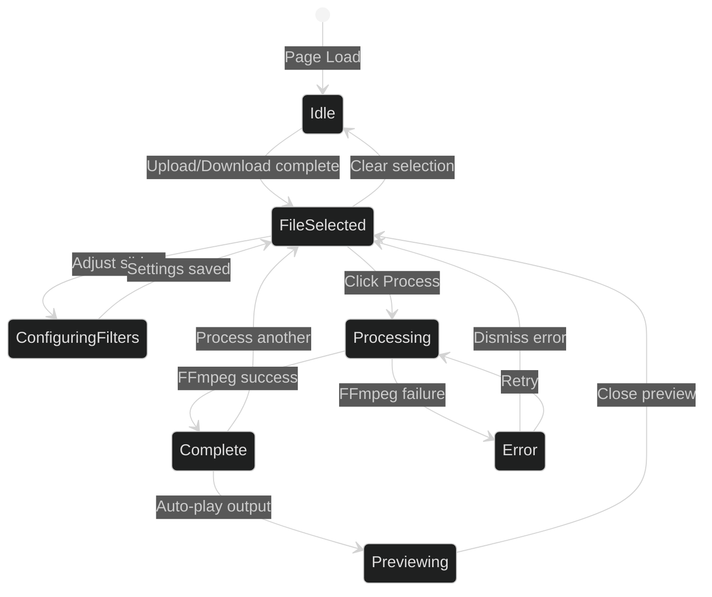

## Upload Flow

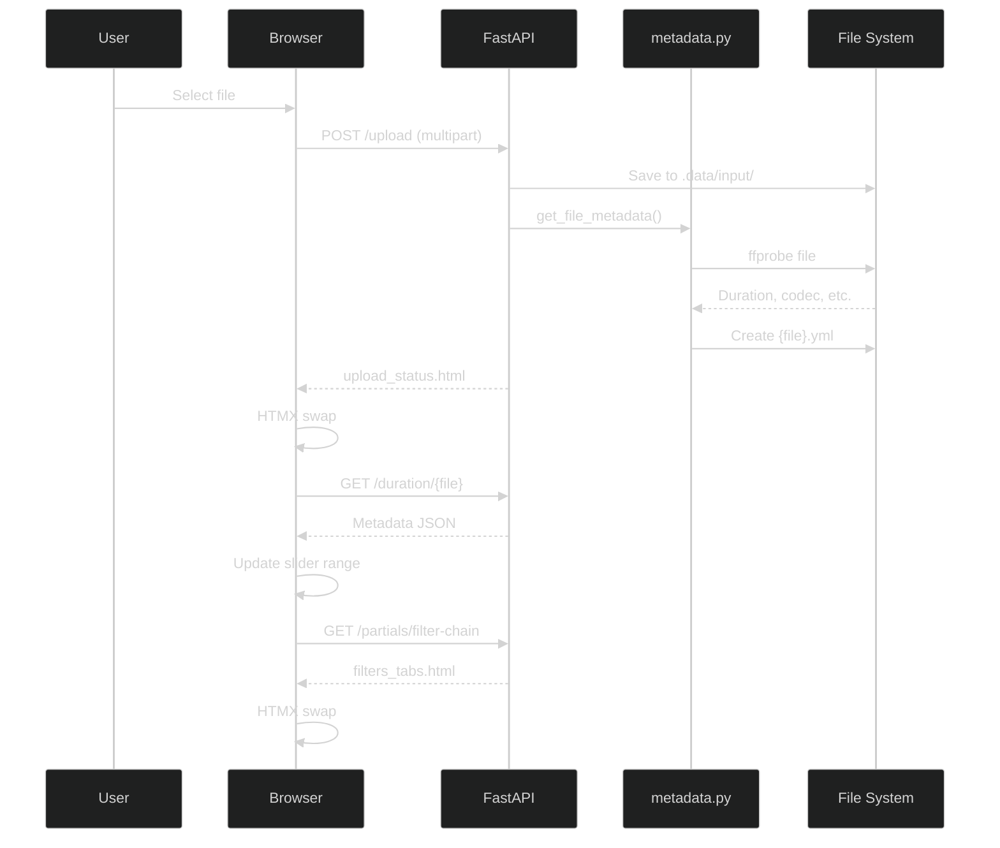

## Processing Flow (Synchronous)

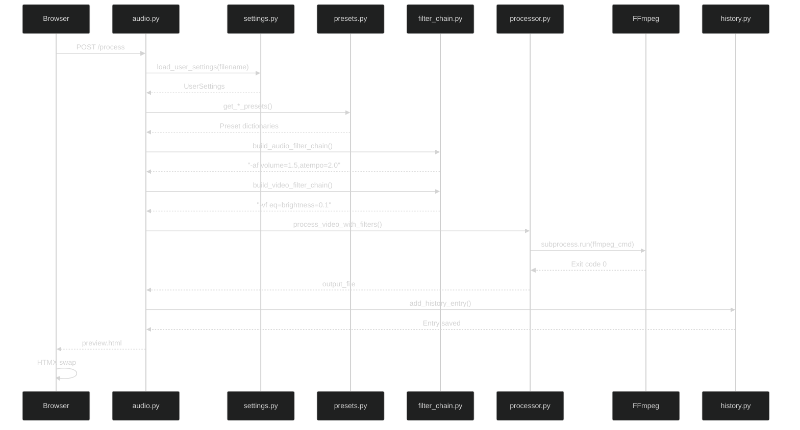

## Processing Flow (SSE Progress)

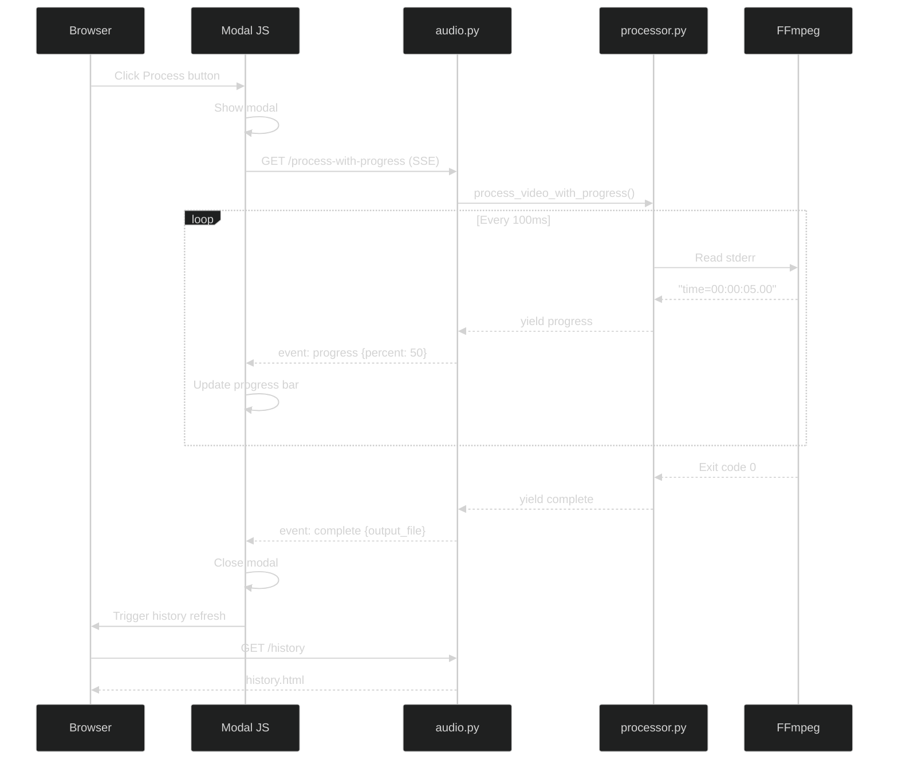

## Filter Chain Building

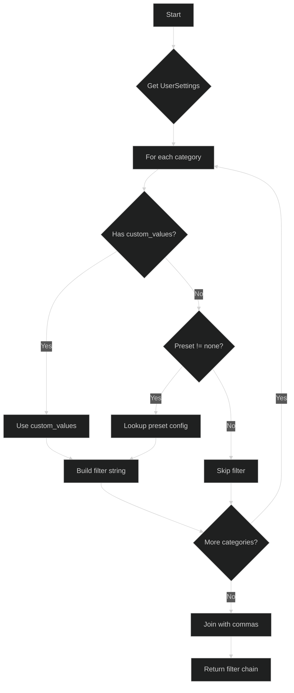

## Audio Filter Chain Order

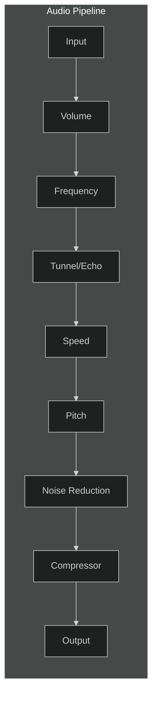

**Filter String Example:**
```
volume=1.5,highpass=f=100,lowpass=f=8000,aecho=0.8:0.85:60:0.3,atempo=2.0,afftdn=nf=-25:nr=50,acompressor=threshold=-20dB:ratio=4
```

## Video Filter Chain Order

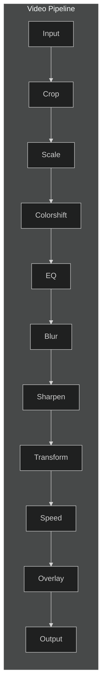

**Filter String Example:**
```
crop=ih*16/9:ih,scale=1280:720,eq=brightness=0.1:contrast=1.2:saturation=0.9,gblur=sigma=0.5,unsharp=5:5:0.3:5:5:0,hflip
```

## Theme Preset Application

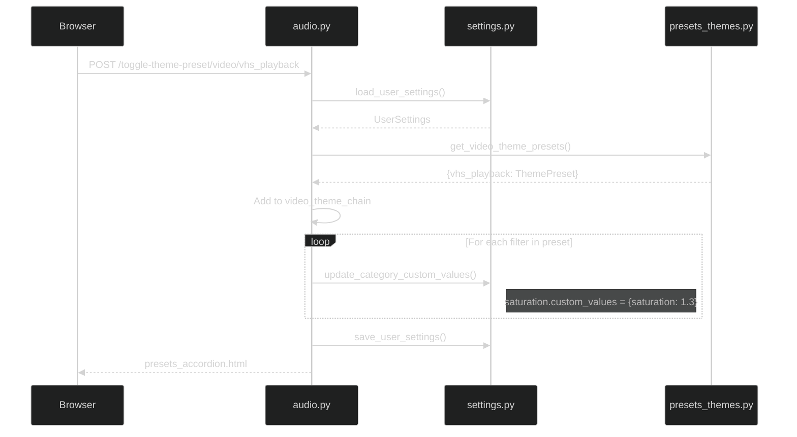

## Theme Preset Filter Priority

When multiple theme presets are chained, filters are applied in order. **Last preset wins** for conflicting filters.

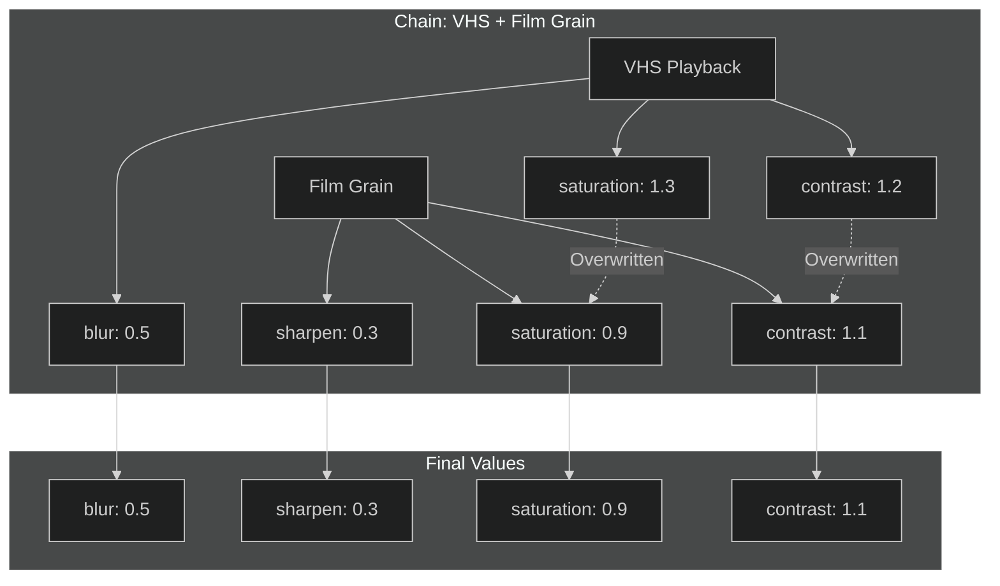

## History Apply Flow

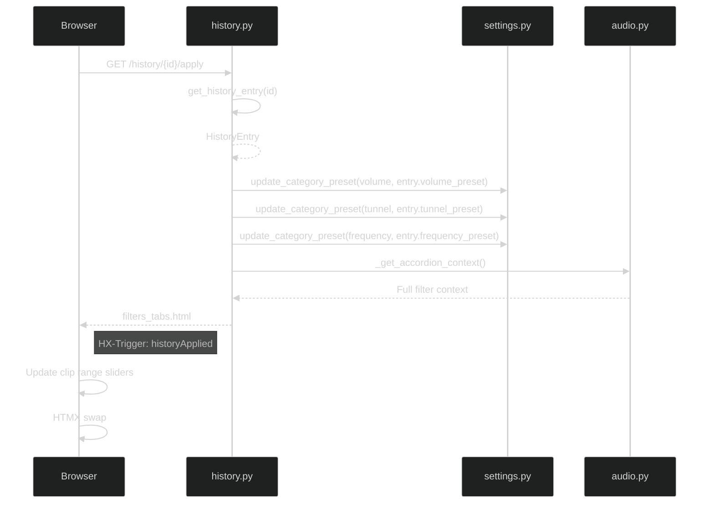

## Download Flow

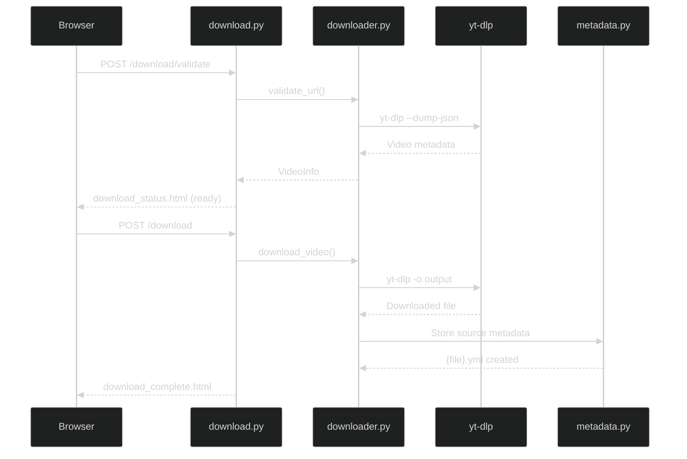

## Error Handling States

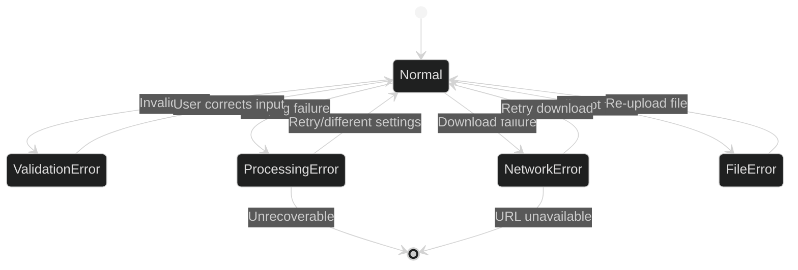
